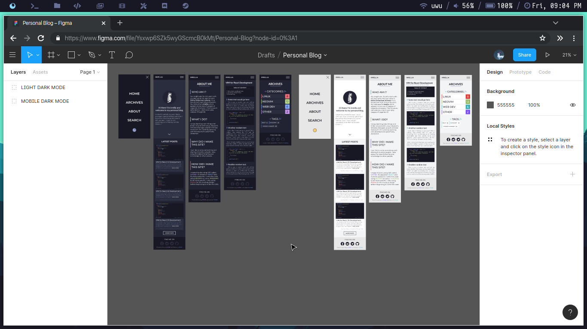
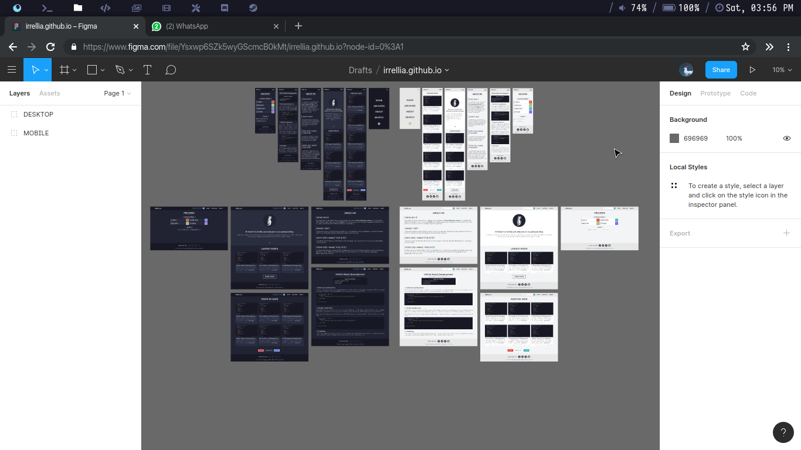
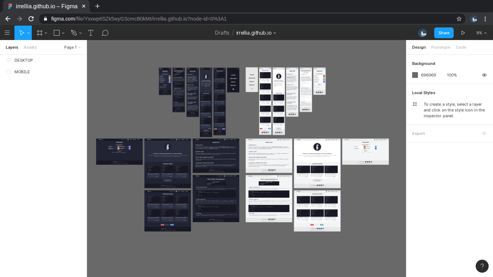
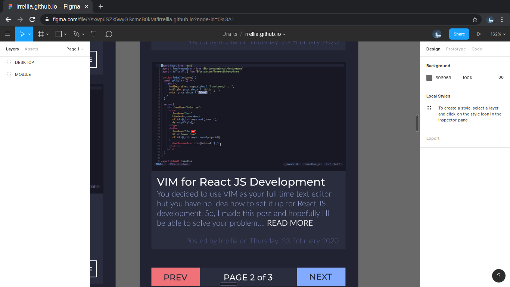
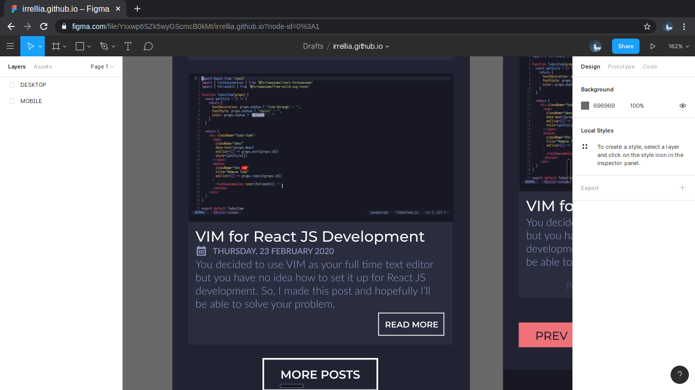

## Introduction
[[snippet]]
| Hi everyone, welcome to my first post. So for the last few weeks I've been interested on this new stack called JAMstack. Many people use it to make their own personal blog by utilizing Static Site Generator (SSG) such as Hugo, Hexo, Eleventy, Gatsby, you name it. They usually hosted it on github pages, netlify, or other headless CMS. As a curious person that likes to tinker around with new stuff, I decided to make my own personal blog.

I decided to use Gatsby as my SSG of choice. I choose Gatsby because it is based on React JS, a framework that I'm already familiar with. I will divide this post into several part, starting from designing the frontend on Figma, coding the actual website using React, deploying it to github pages.

## Design Process
I started to design the site on Figma. If you don't know what Figma is, it's basically a web based software to create mockups or wireframe before you make the actual website to make your life easier. If you haven't yet try it, then go ahead try it [HERE](https://figma.com/)

I want to make my website looks minimalist and clean, so I approach it by using a flat design, lots of squares, sans-serif font, and sharp edges. I also want my blog to have 2 themes (dark and light).

### Mobile Design
First, I make the design for mobile. Because I'm using Figma, I can use Figma Mirror app from Google Play Store to do a live preview on my phone. It is very helpful because I have a budget monitor which isn't quite accurate in terms of colours and my phone have a quite decent colour accuration. I started to make the Home then the About page, the Archives page, the actual Post page that you're currently in, the Posts page that contains all of my posts.

### Colour Choice
I do the dark theme first because I'm a huge fan of dark themed website (or anything, really). I am no expert at choosing colours, so I took the colours from a pretty popular colour scheme called Palenight from Material Themes. I fell in love with this colours. My text editor which is Neovim use this colour scheme. It is so comfortable to look at.

After making the dark one for the mobile, I made the light one. Again, I took the colour scheme from Material Themes and changed it a bit. Here's the screenshot that I took after finishing the mobile layout.

### Responsive Design
I've finished the mobile layout (YAY!), now it is time to make the desktop one. Again, I started out by making the dark themed first then convert it to light theme. Since I've created the mobile version, it is easier to make the desktop one. After done by that, I quite happy with the result

Eventhough I liked how the result, there's one thing that I felt wrong. The light theme doesn't look really 'Light'. It still has those dark parts for the code area. I think asking for people's opinion is a good idea because several minds is better than one, so I asked my friends on Facebook and they said it's better to make the light theme pure white. So I changed the code area to white.

The next day, I check my design again and I think there's a few parts that doesn't seem right. They are the READ MORE button and the date on the post page so I changed them. Here's the difference between them.

After making 2 version of my website (mobile and desktop), I think the design process is finished and the fun and challenging part begins!

## Conclusion
Designing a mockup for your website isn't as easy I though it would, but it sure was quite a fun process. It took 4 days because I also have quite a bit of school homework that I still need to do. Alright, I don't want to make this post a lenghty one so I'm gonna end it right here. See ya next post where I'll talk about the fun part. Bye!

## This part is a test
`this is a blocc` of a code tag that should look like `this` or like `;`

